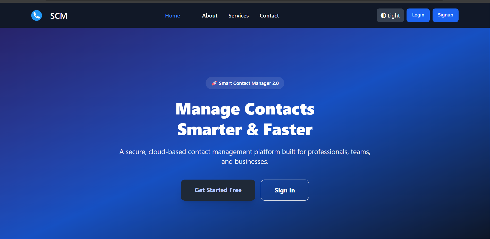
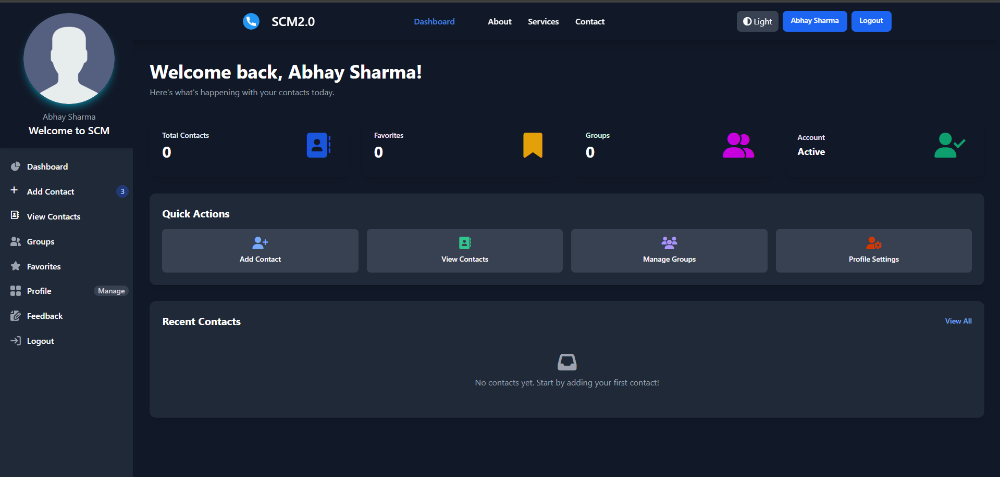
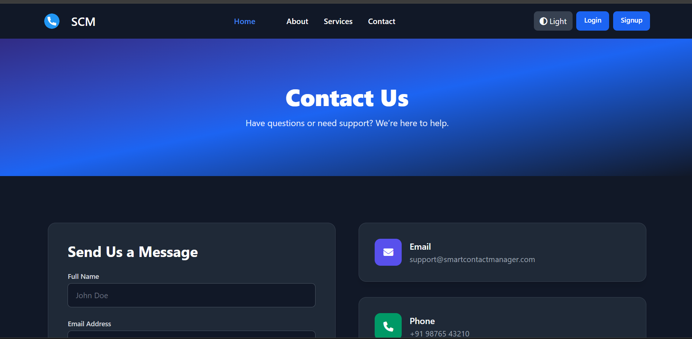
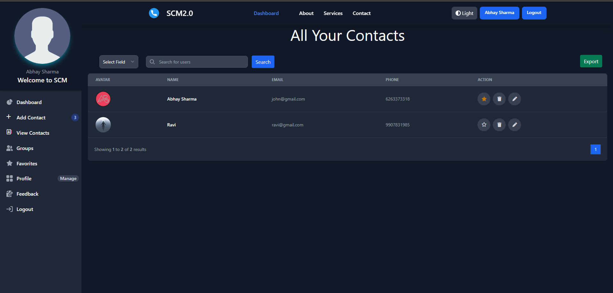

<div align="center">

# 📇 Smart Contact Manager

### A Modern Cloud-Based Contact Management System

[](https://www.oracle.com/java/)
[](https://spring.io/projects/spring-boot)
[](https://aiven.io/)
[](LICENSE)

🔗 **[Live Demo](https://smartcontactmanager-gd9j.onrender.com)** 🔗

[Features](#-features) • [Demo](#-demo) • [Installation](#-installation) • [Tech Stack](#-tech-stack) • [Configuration](#-configuration)

</div>

---

## 📋 Overview

Smart Contact Manager is a comprehensive, cloud-based contact management solution built with Spring Boot. It enables users to securely store, organize, and manage their contacts with advanced features like cloud storage integration, email verification, OAuth2 authentication, and SMS notifications.

## ✨ Features

### Core Functionality
- 🔐 **Secure Authentication** - Email/Password login with email verification
- 🌐 **OAuth2 Integration** - Sign in with Google and GitHub
- 👤 **User Profile Management** - Update profile information and profile pictures
- 📱 **Contact Management** - Add, edit, delete, and search contacts
- 📸 **Cloud Image Storage** - Profile and contact images stored on Cloudinary
- ⭐ **Bookmark Contacts** - Mark important contacts as favorites
- 👥 **Contact Groups** - Organize contacts into custom groups
- 📧 **Email Integration** - Send emails directly to contacts
- 💬 **SMS Notifications** - Send SMS via Twilio integration
- 🔍 **Advanced Search** - Search contacts by name, email, or phone
- 📊 **Dashboard Analytics** - View contact statistics and insights

### Security Features
- Password encryption with BCrypt
- Email verification for new accounts
- Secure session management
- CSRF protection
- SQL injection prevention

## 🎯 Demo

### 🌐 Live Application

Experience the application live at: **[https://smartcontactmanager-gd9j.onrender.com](https://smartcontactmanager-gd9j.onrender.com)**

<div align="center">

### Application Screenshots

<table>
  <tr>
    <td width="50%">
      
      <p align="center"><b>Landing Page</b></p>
    </td>
    <td width="50%">
      
      <p align="center"><b>User Dashboard</b></p>
    </td>
  </tr>
  <tr>
    <td width="50%">
      
      <p align="center"><b>Contact Management</b></p>
    </td>
    <td width="50%">
      
      <p align="center"><b>Contact Details View</b></p>
    </td>
  </tr>
</table>

</div>

## 🛠️ Tech Stack

### Backend
- **Java 21** - Programming language
- **Spring Boot 4.0.1** - Application framework
- **Spring Security** - Authentication & authorization
- **Spring Data JPA** - Database ORM
- **Hibernate** - JPA implementation
- **Maven** - Dependency management

### Frontend
- **Thymeleaf** - Server-side template engine
- **HTML5/CSS3** - Markup and styling
- **JavaScript** - Client-side interactivity
- **Bootstrap** - Responsive UI framework

### Database
- **MySQL** - Relational database
- **Aiven Cloud** - Managed MySQL hosting

### Third-Party Services
- **Cloudinary** - Image storage and CDN
- **Gmail SMTP** - Email service
- **Twilio** - SMS notifications
- **Google OAuth2** - Social authentication
- **GitHub OAuth2** - Social authentication

### Tools & Libraries
- **Lombok** - Reduce boilerplate code
- **Spring Validation** - Input validation
- **Spring DevTools** - Development utilities
- **Spring Dotenv** - Environment variable management

## 📦 Installation

### Prerequisites

Ensure you have the following installed:
- **Java 21** or higher
- **Maven 3.x** or higher
- **Git**

### Step 1: Clone the Repository

```bash
git clone https://github.com/yourusername/SmartContactManager.git
cd SmartContactManager
```

### Step 2: Configure Environment Variables

1. Copy the example environment file:
```bash
cp .env.example .env
```

2. Edit `.env` and add your credentials (see [Configuration](#-configuration) section)

### Step 3: Build the Project

```bash
./mvnw clean install
```

### Step 4: Run the Application

```bash
./mvnw spring-boot:run
```

### Step 5: Access the Application

Open your browser and navigate to:
```
http://localhost:8080
```

## ⚙️ Configuration

### Required Environment Variables

Create a `.env` file in the root directory with the following variables:

#### Database Configuration (Required)
```env
AIVEN_HOST=your-mysql-host.aivencloud.com
AIVEN_DB=your-database-name
AIVEN_USER=your-username
AIVEN_PASSWORD=your-password
```

#### Email Configuration (Required for email features)
```env
EMAIL_USERNAME=your-email@gmail.com
EMAIL_PASSWORD=your-app-password
```
> **Note:** Use [Google App Password](https://support.google.com/accounts/answer/185833) instead of your regular password

#### OAuth2 Configuration (Optional)

**Google OAuth2:**
```env
GOOGLE_CLIENT_ID=your-google-client-id
GOOGLE_CLIENT_SECRET=your-google-client-secret
```
Get credentials from [Google Cloud Console](https://console.cloud.google.com/)

**GitHub OAuth2:**
```env
GITHUB_CLIENT_ID=your-github-client-id
GITHUB_CLIENT_SECRET=your-github-client-secret
```
Get credentials from [GitHub Developer Settings](https://github.com/settings/developers)

#### Cloudinary Configuration (Required for image uploads)
```env
CLOUDINARY_CLOUD_NAME=your-cloud-name
CLOUDINARY_API_KEY=your-api-key
CLOUDINARY_API_SECRET=your-api-secret
```
Sign up at [Cloudinary](https://cloudinary.com/)

#### Twilio Configuration (Optional - for SMS features)
```env
TWILIO_ACCOUNT_SID=your-account-sid
TWILIO_AUTH_TOKEN=your-auth-token
TWILIO_PHONE_NUMBER=your-twilio-phone-number
```
Sign up at [Twilio](https://www.twilio.com/)

## 🗄️ Database Setup

### Option 1: Aiven MySQL (Recommended)

1. Sign up at [Aiven.io](https://aiven.io/)
2. Create a new MySQL service
3. Copy the connection details to your `.env` file
4. The application will automatically create tables on first run

### Option 2: Local MySQL

1. Install MySQL locally
2. Create a database:
```sql
CREATE DATABASE scm;
```
3. Update `.env` with local credentials

## 🚀 Usage

### Creating an Account
1. Navigate to the registration page
2. Fill in your details (name, email, password)
3. Verify your email address
4. Log in to access your dashboard

### Adding Contacts
1. Go to "Add Contact" from the dashboard
2. Fill in contact details
3. Upload a profile picture (optional)
4. Assign to a group (optional)
5. Save the contact

### Managing Contacts
- **View All Contacts** - See all your saved contacts
- **Search** - Find contacts quickly by name, email, or phone
- **Edit** - Update contact information
- **Delete** - Remove contacts permanently
- **Bookmark** - Mark important contacts as favorites
- **Groups** - Organize contacts into categories

## 📁 Project Structure

```
SmartContactManager/
├── src/
│   ├── main/
│   │   ├── java/com/scm/
│   │   │   ├── config/          # Configuration classes
│   │   │   ├── controllers/     # REST & MVC controllers
│   │   │   ├── entities/        # JPA entities
│   │   │   ├── forms/           # Form DTOs
│   │   │   ├── helpers/         # Utility classes
│   │   │   ├── repositories/    # Data access layer
│   │   │   ├── services/        # Business logic
│   │   │   └── SmartContactManagerApplication.java
│   │   └── resources/
│   │       ├── static/          # CSS, JS, images
│   │       ├── templates/       # Thymeleaf templates
│   │       └── application.properties
│   └── test/                    # Unit tests
├── screenshorts/                # Application screenshots
├── .env                         # Environment variables (not in git)
├── .env.example                 # Environment template
├── pom.xml                      # Maven dependencies
└── README.md                    # Project documentation
```

## 🔒 Security Best Practices

- Never commit `.env` file to version control
- Use strong passwords for database and email
- Enable 2FA on third-party services (Google, GitHub, Twilio)
- Regularly update dependencies
- Use HTTPS in production
- Keep API keys and secrets secure

## 🤝 Contributing

Contributions are welcome! Please follow these steps:

1. Fork the repository
2. Create a feature branch (`git checkout -b feature/AmazingFeature`)
3. Commit your changes (`git commit -m 'Add some AmazingFeature'`)
4. Push to the branch (`git push origin feature/AmazingFeature`)
5. Open a Pull Request

## 📝 License

This project is licensed under the MIT License - see the [LICENSE](LICENSE) file for details.

## 👨‍💻 Author

**Your Name**
- GitHub: [@yourusername](https://github.com/yourusername)
- Email: your.email@example.com

## 🙏 Acknowledgments

- Spring Boot team for the amazing framework
- Aiven for reliable MySQL hosting
- Cloudinary for image storage solutions
- All open-source contributors

## 📞 Support

For support, email your.email@example.com or open an issue in the repository.

---

<div align="center">

Made with ❤️ using Spring Boot

⭐ Star this repository if you find it helpful!

</div>
